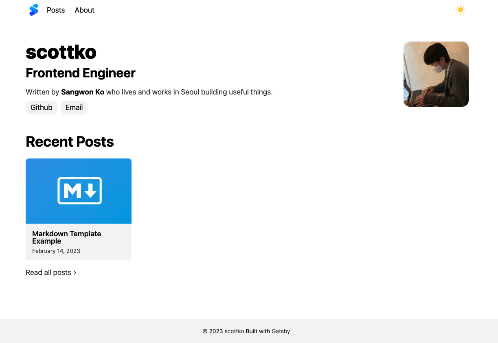
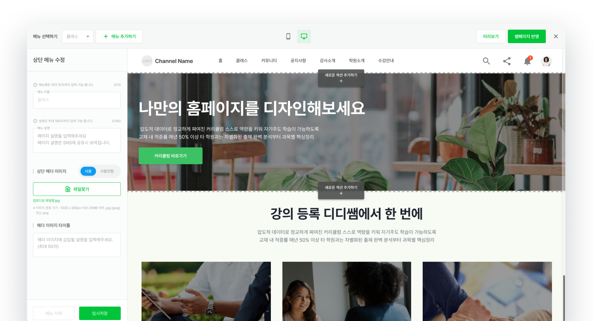
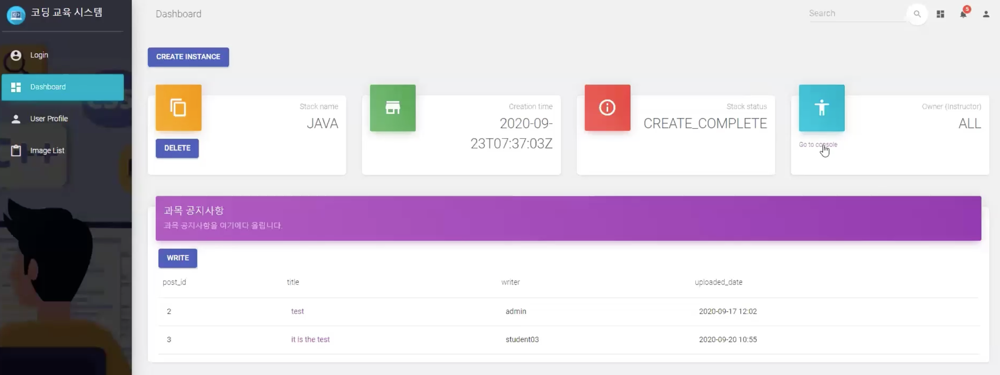

# **고상원 (Sangwon Ko)**

## Front-End Engineer

_
<i>Last updated: 2025.01.25</i>
_

사용자 친화적인 서비스 구현에 집중하는 4년 차 프론트엔드 개발자 고상원입니다.
 
온라인 B2B 교육 플랫폼을 제공하는 에듀테크 기업에서 관리자 페이지와 디자인 시스템 등의 다양한 프로젝트를 주도적으로 개발하며 실무 역량을 쌓았고, 현재는 블록체인 Web3 도메인에서 탈중앙화 어플리케이션을 개발하며 기술적 도전을 경험하고 있습니다.
좋은 사용자 경험을 제공하기 위한 UI/UX를 구현하는 것에 많은 관심을 가지고 있으며,
코드 품질을 높이고 더 효율적인 개발 환경을 만들어내기 위해 꾸준한 배움과 성장을 추구합니다.

|             |                               |
| :---------: | ----------------------------- |
| **GitHub**  | <https://github.com/scotttko> |
| **Contact** | <kosang1017@gmail.com>        |

 

# <u>Experiences</u>

## 라이트스케일

|              |                                                          |
| -----------: | -------------------------------------------------------- |
|   **period** | 23.05 ~ current                                          |
| **position** | Eco FE 팀 / Front-End Engineer                           |
| **projects** | Kroma Hub / WemixonKroma / KGH / Spectrum / KCU / Kroket |
|     **tech** | TypeScript, React, Next.js, react-native, viem/wagmi     |

#### TBD

 
 

## 주식회사 산타

|              |                                                                               |
| -----------: | ----------------------------------------------------------------------------- |
|   **period** | 21.01 ~ 23.05                                                                 |
| **position** | FE 팀 / Front-End Engineer                                                    |
| **projects** | <a href="https://landing.didisam.com" target="_blank">디디쌤</a> / 디디캐스트 |
|     **tech** | JavaScript, TypeScript, React, Next.js, Storybook, GitHub Actions             |

#### 디디쌤 프론트엔드 개발 (22.01 ~ 23.05)

- 마이페이지 도메인 공통 영역 구축 및 라우팅 구조 설계
- 강의 홈페이지 wysiwyg 빌더 기능 구현
  - 홈페이지 개설 단계에서 기본 템플릿 제공하여 최초 홈페이지 개설의 편의성 증가
  - 홈페이지를 구성하는 다양한 섹션들에 대한 하나의 JSON 데이터를 프론트엔드 영역에서 최대한 처리하여 서버와의 데이터 통신을 최소화하고 빠른 인터랙션이 가능한 편집 기능 제공
- 회원 인증 프로세스 개발
  - sns 인증 및 nice 휴대폰 실명인증 연동
  - 신규 회원의 로그인 과정에서 발생하는 중복적인 인증처리를 최소화하여 사용성 개선
- Storybook을 활용한 디자인 시스템을 구축하여 컴포넌트 단위의 개발 활성화
  - CI 구성 및 Github Actions를 사용한 npm 패키지 배포 자동화
- 커밋 메시지 및 pr 컨벤션 체계화하여 협업 생산성 강화

#### 디디캐스트 프론트엔드 개발 (21.05 ~ 21.11)

- 강의 운영 관리자를 위한 어드민 도메인 개발
- 관리자 페이지의 클래스/패키지 개설 및 관리 기능 구현
- git-flow 전략을 도입하여 브랜치 관리 및 개발 프로세스 체계화
- AWS Chime SDK를 활용한 실시간 라이브 강의 개발

#### 디디캐스트 랜딩페이지 (21.01 ~ 21.03)

- JWT 토큰 기반 인증 처리를 위한 상태 관리 패턴 구축
- 로그인 / 회원가입 및 토큰 관리 api 모듈 구현
- 무료체험 신청 form validation 처리 구현

 

# <u>Projects</u>

## Gatsby 기술 블로그

<!-- 

 -->

<!--  -->

`React` `Gatsby` `TypeScript` `Emotion`

React 기반의 Static Site Generator인 Gatsby를 활용하여 만든 개발 블로그입니다 기존에 운영 중인 다양한 테마의 기술 블로그들을 참고하여 블로그 UI를 구현하였으며 블로그 글 포스팅은 gatsby의 내장 plugin을 사용하여 마크다운 파일을 파싱하였습니다. 부수적인 기능으로 다크모드, utterances 커멘트 기능, framer-motion 애니메이션 등을 추가하였으며 앞으로 TOC(Table of Contents), 카테고리, 검색 등의 기능을 추가할 예정입니다. 소스 코드는 https://github.com/scotttko/gatsby-blog 에 공개되어 있습니다.

 

## DIDISAM

`React` `Next.js` `TypeScript` `Storybook`

교육의 모든 프로세스를 디지털 전환하여 학습 데이터를 축적하고 교육 운영을 자동화하는 목적을 가지는 서비스입니다. 온라인 교육을 제공하고자 하는 사용자들은 나만의 웹페이지를 wysiwyg 빌더 기능을 통해 개설하고 다양한 커리큘럼을 수강생들에게 제공하며, 학습 테스트 및 수강률/출석률 체크 등의 기능을 통해 학습 데이터를 관리할 수 있습니다.

 

## OpenStack 기반 코딩 교육 지원 시스템

`OpenStack` `React` `JavaScript` `Flask`

클라우드 기반의 코딩 교육을 지원하기 위한 가상머신 관리 환경 구축

- OpenStack Keystone 인증 컴포넌트를 활용한 회원 인증 기능 구현
- OpenStack Swift 오브젝트 스토리지를 활용한 커뮤니티 게시판 기능 구현
- React를 활용하여 생성된 가상 머신 구축 환경에 대한 대시보드 UI 구현

 

# <u>Activities</u>

### 2020 산학협력 R&D 학부연구원 (20.02 ~ 20.11)

- 유의적 버저닝 및 git의 개념을 활용하여 오픈스택의 HOT 파일의 버전을 관리하는 시스템을 제시하는 국내논문을 개제
- 특허 출원:
  <a href="https://doi.org/10.8080/1020200143533" target="_blank">버전 관리 시스템을 적용한 클라우드 오케스트레이션 템플릿 관리 방법 및 장치 (2020.10.30)</a>
- 버전 관리 시스템의 프로세스에 대한 요구사항을 작성하고 이를 기반으로 아키텍처 구축 및 프로토타입 개발 진행

### DSC Pusan National 2기 (20.03 ~ 20.07)

- DSC (Developer Student Clubs) Pusan National의 2기 멤버로 활동
- iOS / 알고리즘 스터디 및 교육 세션과 세미나 진행

### 캐나다 해외 장기 인턴쉽 (19.01 ~ 19.12)

- 6개월의 교육 과정 & 6개월의 IT 기업 인턴쉽 프로그램 과정으로 이루어진 Co-op 장기 해외 인턴십 참여

 

# <u>Skills</u>

### HTML / CSS

- 시멘틱 마크업을 준수합니다.
- 웹 표준 및 웹 접근성을 고려한 설계를 추구합니다.
- 크로스 브라우징을 지원할 수 있습니다.
- Sass와 같은 CSS Preprocessor을 사용할 수 있습니다.
- styled-component, emotion을 활용한 CSS-in-JS를 적용할 수 있습니다.
- 반응형을 적용할 수 있습니다.

### JavaScript

- ES6 이상의 문법에 익숙합니다.
- map, filter, reduce와 같은 고차함수를 적극적으로 사용합니다
- 비동기 작업을 하는데 익숙합니다. (promise, async/await)

### TypeScript

- TypeScript의 정적 타입 시스템을 사용한 프론트엔드 개발을 선호합니다.
- Generic, Utility Type 등의 다양한 문법에 익숙합니다.

### React / Next.js

- 함수형 컴포넌트를 구현하고 React hooks 사용에 능숙합니다.
- redux, rematch, recoil 등의 Flux 패턴 기반 상태 관리 라이브러리를 사용한 경험이 있습니다.
- 컴포넌트 라이프 사이클을 잘 이해하고 있으며, 각 상황에 맞는 메소드를 활용할 줄 압니다.
- Memoization을 적절히 구현하여 렌더링 최적화를 지원할 수 있습니다.
- Storybook을 활용한 컴포넌트 주도 개발을 경험해봤습니다.
- Next.js 기반의 SSR 개발 경험을 가지고 있습니다.
- Next.js의 pre-fetch, code splitting, image optimization 등의 다양한 최적화 기능을 적극적으로 활용합니다.
- Jest와 React Testing Libary를 사용하여 프론트엔드 테스트 코드를 작성할 수 있습니다.

### 기타

- Git을 능숙하게 사용할 줄 알며, Git-flow 등의 방법론을 적용한 개발이 가능합니다.
- Github Actions를 사용한 CI 구성 및 배포 자동화 경험이 있습니다.
- Jira, Slack, Notion 등의 커뮤니케이션 툴 사용이 익숙합니다.
- 데일리 스크럼 및 스프린트 개발을 통한 애자일 프로세스를 경험해봤습니다.
- Figma, Zeplin을 통한 디자이너와의 협업이 가능합니다.

 

# <u>Education</u>

### 부산대학교 / 전기컴퓨터공학부 정보컴퓨터공학과

(16.03 ~ 21.08) 졸업

 
