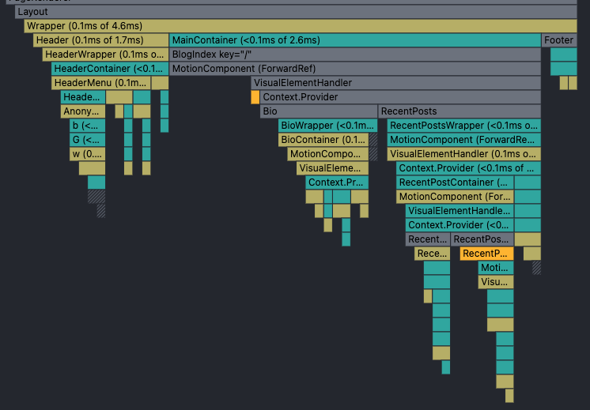
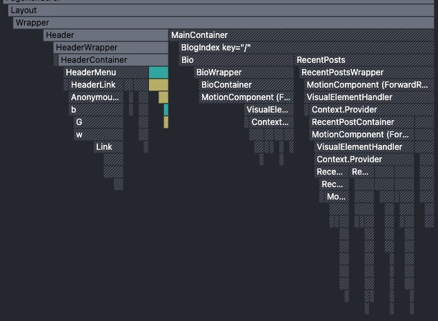

기술 블로그를 개설하고 첫 번째 글을 작성한지 벌써 2년 가까운 시간이 흘렀지만, 처음 다짐과는 달리 새로운 도메인에 도전하게 되면서 블로그 운영을 제대로 병행하지 못하였다 😭<br />
그 동안 제가 실무에서 다룬 내용들과 그 안에서 배운 것들을 기록하지 못한 것에 아쉬움이 남지만 이제라도 하나씩 기록해나가기 위해 그 시작을 가볍게 블로그 개선기로 하려고 한다 (나름의 새해 다짐 비스무리한것,,)

<br />

## 일단 만들긴 했는데..

이왕 블로그 운영할거 프론트엔드 개발을 하는 입장에서 직접 만들어봐도 의미가 있겠다 싶어서 만들긴 했습니다만..
생각처럼 블로그를 활용하지 못하면서 처음 배포한 상태 그대로 방치되는 지경에 이르렀다. 그러다 이번에 블로그를 다시 살려보기 위해 살펴보니 처음 만들면서는 보이지 않았던 부족한 점들이 눈에 띄어 그 부분들을 먼저 수정하게 되었다. 그리고 이전 글에 TODO로 남겨두었던 추가 기능들 중에 필요하다고 생각되는 기능도 추가해 보았다.

그래서 이번 글엔 이러한 개선 사항들을 정리해보려고 한다.

<br />
<hr />

## 무엇을 개선했는가

### 1. 다크모드

이전 글에서 [다크모드 구현 방식에 대해서 이런저런 설명](https://scottko.netlify.app/starting-gatsby-blog/#2-%EB%8B%A4%ED%81%AC%EB%AA%A8%EB%93%9C)을 했었는데, 다시 보니 최선의 방법은 아니였던 것 같다.
기존엔 emotion의 `ThemeProvider`를 사용하여 conext 방식으로 다크모드를 제어했었다. 그 과정에서 FoUC 문제를 해결하기 위해 `gatsby-ssr`에 접근하여 theme 데이터를 localStorage에서 받아와 적용하고 `useLayoutEffect`를 사용하여 theme state를 업데이트 하는 방식을 사용했다.

그런데 해당 방식은 서버에서 렌더한 DOM에는 포함되지 않은 theme attribute가 `setPreBodyComponents`에서 삽입된 script로 인해 추가되면서 hydration mismatch 에러가 발생한다.

#### 해결 방법 1

`replaceHydrateFunction`을 사용하면 hydration 에러는 사라진다.

```typescript
//gatsby-browser.tsx

export const replaceHydrateFunction = () => {
  return (element: ReactNode, container: ReactDOM.Container) => {
    const root = ReactDOM.createRoot(container);
    root.render(element);
  };
};
```

<br />

하지만 이 방법은 좋은 방법이 아니다.

그 이유는 `replaceHydrateFunction`이 어떤 역할을 하는지 파악하면 알 수 있다. 기본적으로 Gatsby가 hydration을 위해 `ReactDOM.hydrate()`를 사용하여 서버에서 렌더된 DOM을 사용하려고 하는데, `replaceHydrateFunction`은 이 방식을 `ReactDOM.render()`로 대체하겠다는 것이다.
따라서, hydration을 하지 않고 서버에서 그린 DOM과 관계없이 클라이언트에서 다시 렌더링이 진행되고 hydration mismatch가 날 일도 사라지게 되는 것이다.

그 말인즉슨, hydration의 이점을 살리지 못하고 DOM트리를 다시 그리게 되면서 성능 또한 저하되는 것이다.

#### 해결 방법 2

생각보다 쉽게 위의 문제를 해결할 수 있었다.

```typescript
//gatsby-ssr.tsx

setHtmlAttributes({ lang: 'en', 'data-theme': 'dark' });
```

<br />

서버에서는 theme 값을 알 수 없기 때문에 디폴트 값을 data-theme으로 설정하여 클라이언트와 상태를 맞춤으로 간단하게 해결했다.

#### CSS variables

위의 hydration 에러를 해결하면서 data-theme 속성을 사용했는데, theme 적용을 기존 ThemeProvider에서 theme 객체를 교체하는 방식에서 CSS variables로 변경했기 때문이다.

방식을 바꾼 이유는 기존 ThemeProvider를 통한 theme switch는 theme이 변경될 때마다 해당 theme 컬러값을 참조하는 모든 컴포넌트가 리렌더링되는 성능적인 이슈가 있었기 때문이다. 그리고 CSS 변수로 제어권을 넘기고 JS의 의존도를 낮춰서 테마 설정에 대한 불필요한 코드를 제거하는 목적도 있었다.

하지만 기존 ThemeProvider를 제거하기엔 공수가 너무 많이 들 것 같아서 ThemeProvider는 유지하면서 CSS 변수를 활용할 수 있도록 수정해보았다.

```css
:root {
  --color-bg: #ffffff;
  --color-sub-bg: #ededf1;

  --color-main-text: #000000;
  --color-sub-text: #383a42;

  --color-button-bg: #ededf1;
  --color-button-bg-hover: #d8dadf;
}

[data-theme='dark'] {
  --color-bg: #25262c;
  --color-sub-bg: #383a42;

  --color-main-text: #ffffff;
  --color-sub-text: #b5b9c4;

  --color-button-bg: #383a42;
  --color-button-bg-hover: #3f434d;
}
```

```typescript
export const defaultTheme = {
  palette: {
    bgColor: 'var(--color-bg)',
    subBgColor: 'var(--color-sub-bg)',

    mainTextColor: 'var(--color-main-text)',
    subTextColor: 'var(--color-sub-text)',

    buttonBgColor: 'var(--color-button-bg)',
    buttonBgHoverColor: 'var(--color-button-bg-hover)',
  },
};
```

<br />

이렇게 필요한 테마 컬러들에 대해 CSS 변수를 전역 스타일로 지정한 후, defaultTheme과 같은 theme 객체를 만들어 ThemeProvider에 주입했다.
이로써 최소한의 코드 수정을 통해 기존 코드 베이스에서 CSS 변수를 사용하도록 변경하였고 처음 선언된 CSS 변수를 브라우저에서 스위칭하기 떄문에, 테마 변경에 대한 컴포넌트 리렌더링은 더 이상 발생하지 않는다.

|                                                         |                                                           |
| ------------------------------------------------------- | --------------------------------------------------------- |
| 기존 방식 (theme switch)                                | 개선 방식(CSS variables)                                  |
|  |  |

### 2. TOC (Table of Contents)

TOC 기능은 글의 목차를 보여주고 해당 목차에 링크를 걸어 이동시켜주는 역할을 하는 기능이다.
대부분의 블로그가 지원하는 기능이기도 하고 블로그에 방문자들이 글을 읽을 때 있으면 편할 것 같아서 가장 먼저 추가하게 되었다.

우선 Gatsby의 플러그인 중 `gatsby-remark-autolink-headers`라는 플러그인을 사용하여 마크다운 파일의 header에 링크를 걸어주었다.

그 다음, 각 포스트 마크다운에 대한 TOC를 받아오기 위해 `gatsby-transformer-remark`의 `tableOfContents` 필드를 쿼리에 추가하여 header를 html으로 파싱한 데이터를 받아온다.

```typescript
//gatsby-config.ts

 {
    resolve: `gatsby-remark-autolink-headers`,
    options: {
      elements: [`h1`, `h2`, `h3`],
    },
 }
```

```graphql
  markdownRemark(id: { eq: $id }) {
    ...
    tableOfContents(maxDepth: 3)
  }
```

<br />

이제 파싱한 TOC 데이터를 그려야 하는데 `dangerouslySetInnerHTML`를 사용하여 UI 자체는 큰 문제 없이 구현할 수 있었다.
이 기능을 구현하면서 내가 신경 쓴 부분은 내가 위치한 header에 대한 하이라이팅 기능이였는데,
나는 `IntersectionObserver`를 사용히야 header 태그의 intersected 상태를 확인하고 하이라이트 되도록 구현하였다.

```ts
  ...

  const handleScroll = (entries: IntersectionObserverEntry[]) => {
    entries.forEach((entry) => {
      if (entry.isIntersecting) {
        setActiveId(entry.target.id);
      }
    });
  };

  useEffect(() => {
    observer.current = new IntersectionObserver(handleScroll, { rootMargin: `0% 0% -80% 0%` });

    const anchors: NodeListOf<HTMLAnchorElement> = document.querySelectorAll(`.${id} a`);
    const anchorArr = Array.from(anchors);

    if (anchorArr) {
      const tocList = anchorArr.map((a) => getDecodedLink(a.hash));
      tocList.forEach((elId) => {
        const el = document.getElementById(elId);
        if (el) {
          observer.current?.observe(el);
        }
      });
    }

    return () => observer && observer.current?.disconnect();
  }, [id]);

  ...
};
```

### 3. 포스트 카테고리 기능

각 포스트를 카테고리화하면 포스트의 목적에 따라 분류하고 방문자들도 원하는 글만 추려서 보기 좋을 것 같아서 추가하였다.
이 기능은 구현하기 크게 어려운 점은 없었다. 각 포스트 글의 메타데이터에 categories 필드를 추가하고 해당 데이터를 공백 기준으로 split해서 카테고리 리스트를 추가헸다.

```mdx
title: 기술 블로그 개선하기
date: '2025-01-27T00:00:00Z'
thumbnail: ./blog-imp.jpg
categories: Dev 회고
```

<br />

### 4. Inter local font 적용

한글 수직 정렬이 안 맞는 것 같아서 확인해보니 font를 따로 추가하지 않아서 발생하는 문제였다.
그래서 어떻게 적용할까 하다 [Gatsby 문서](https://www.gatsbyjs.com/docs/how-to/styling/using-local-fonts/)에 따라 Inter local font를 추가하였다.

<br />
<hr />

## 마치며

이번 글은 기술적으로 큰 의미가 있진 않았지만, 다시 블로그를 잘 운영해보겠다는 나의 마음가짐을 담아 재정비하는 의미로 적어보았다. 앞으로는 기술적인 내용 뿐만 아니라, 평소에 고민하고 그 안에서 깨닫는 것들도 함께 기록하면서 다가오는 2025년을 더 의미있게 보낼 수 있길 바라본다.
