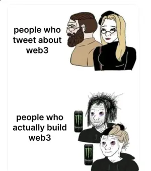

블로그를 재개하기로 한 후 가장 먼저 적어보고 싶었던 주제는 바로 내가 현재 종사하고 있는 Web3 블록체인 도메인이였다. 아직은 Web3라는 개념을 낯설게 느끼는 사람들도 많을 것 같아서 과연 프론트엔드 개발자가 이 낯선 도메인에서 무슨 역할을 수행하고 어떠한 기여를 해낼 수 있을지에 대해 적어보려고 한다.<br />
(물론 나도 아직까지 모르는 게 더 많은 어려운 도메인이다,,)



<br />

## Web3란?

본문에 들어가기 앞서, Web3가 무엇인지에 대해서 간단히 정리해보자.

우리가 일반적으로 알고 있는 기존의 웹은 기본적으로 유저와 쌍방향 소통을 수행하며 모든 어플리케이션과 데이터가 **중앙화된 서버의 관리**
하에 운영된다는 핵심 개념을 가진다.

<br />
<hr />

## Web3에서의 프론트엔드 개발

여러가지 선택지 중, React 기반의 Static Site Generator인 [Gatsby](https://www.gatsbyjs.com/)를 활용하여 블로그를 만들게 되었습니다. 물론 velog, medium과 같은 기존 블로그 서비스를 활용하거나 Next.js, jekyll와 같은 다른 선택지도 있었지만 Gatsby가 제공하는 다양한 장점들을 활용하여 나만의 블로그를 직접 만들어보고자 했습니다.

#### 1. 익숙한 React 기반

가장 많이 사용하는 React를 그대로 활용하여 React의 여러 장점들을 그대로 가져갈 수 있다는 장점이 있습니다.

#### 2. JAMStack 아키텍쳐

> JAMStack: J (JavaScript) + A (API) + M (Markup)

Gatsby는 JAMStack 아키텍쳐 기반의 프레임워크로 pre-render된 마크업 파일을 CDN(Content Delivery Network)을 통해 제공하는데 이로 인해 더 빠르게 웹사이트를 제공할 수 있으며, 서버 관리도 최소화할 수 있습니다.

#### 3. 다양한 plugin의 활용성

Gatsby가 제공하는 다양한 plugin의 이점을 채택하여 가장 빠르게 기본적으로 필요한 기능들을 구현할 수 있습니다.
`gatsby-transformer-remark`와 같은 plugin은 마크다운 문법을 html 형태로 파싱해주는 역할을 수행해 손쉽게 포스트들을 생성해낼 수 있으며, `gatsby-plugin-image`는 lazy loading 등의 이미지 최적화 작업을 도와줍니다.

#### 4. GraphQL

각각의 엔드포인트에서 고정된 데이터를 받을 수 있는 REST API와 다르게 단일 엔드포인트에서 화면 구성에 필요한 데이터들만 받아와 사용할 수 있으며 Gatsby에서는 페이지 또는 Static Query 컴포넌트에서 필요한 데이터들을 조회하는 역할으로 사용됩니다 . 평소에 GarphQL에 대한 궁금증을 가지고 있었어서 이번 기회에 간단하게나마 접해볼 수 있다는 점이 Gatsby를 선택하는 이유 중 하나가 되었습니다.

<br />
<hr />

## Web3 프론트엔드 개발의 도전 과제

### 1. UI 디자인

디자인에 대한 견해가 넓진 않기 때문에 다양한 레이아웃을 가진 여러 기술 블로그들을 찾아보면서 제가 원하는 UI를 적절하게 만들어갔습니다.
아직 다듬어야 할 점들도 있어서 추가적인 기능들을 덧붙여가면서 조금씩 개선해 나갈 예정입니다. 아래 링크들은 블로그를 만들면서 제가 참고했던 블로그들입니다.

- https://jbee.io
- https://bepyan.github.io
- https://www.jeong-min.com
- https://blog.chayeoi.site

<br />

### 2. 다크모드

다크모드 기능은 어떻게 보면 부수적인 기능일 수 있겠지만 블로그를 직접 구현하기로 결정한 순간부터 추가하고 싶었던 기능이였고 그만큼 많은 신경을 써서 구현하였습니다.
처음에 다크모드들 구상하면서는 현재 사용 중인 css 라이브러리인 **emotion**의 도움을 받아 `ThemeProvider`의 theme을 스위치하는 정도로 가볍게 생각했습니다. 하지만 실제로 구현해보면서 예상치 못한 이슈를 발견하게 되어 구현하는데 시간이 생각보다 많이 소요되었습니다.

#### 적절한 컬러 조합

[Materia Design](https://m2.material.io/design/color/dark-theme.html)의 가이드를 참고하면서 적절한 다크 모드에 대한 컬러 palette를 정해보았으나 컬러 조합은 아직 조정 중이며 더 나은 조합을 찾게 되면 수정해볼 생각입니다.

<br />

#### theme 설정 유지하기

```typescript
const useTheme = () => {
  const [theme, setTheme] = useState<ThemeType>('light')

  useLayoutEffect(() => {
    const storedTheme = window.localStorage.getItem('theme') as ThemeType | null
    if (storedTheme !== null) {
      setTheme(storedTheme)
    } else {
      const systemDarkTheme = window.matchMedia('(prefers-color-scheme: dark)')
      setTheme(systemDarkTheme.matches ? 'dark' : 'light')
    }
  }, [])

  ...
}
```

<br />

화면을 새로고침할 경우나 블로그에 재방문하였을 경우에도 사용자가 설정한 컬러 모드를 유지시켜야 하는 이슈가 발생하였습니다. 해당 이슈를 해결하기 위해 `localStorage`를 활용하여 테마 설정 정보를 저장하고 활용할 수 있도록 구현하여 해결할 수 있었습니다. 또한, `prefers-color-scheme`을 통해 사용자의 시스템 테마 정보를 가저와 테마의 초기 설정까지 함께 구현하였습니다. 그러나 이렇게 테마를 유지시키기 위해 구현했던 방식이 아래의 이슈를 발생시켰습니다.

<br />
<hr />

##

- TOC 기능
- pagination or inifinte scroll
- 검색엔진 최적화
- 포스트 검색 기능
- PWA 지원

<br />
<hr />

## 마치며

Gatsby를 활용하여 직접 만들어보는 것으로 저의 첫 블로그 운영이 시작되었는데 처음 접해보는 기술로 하나의 작은 프로젝트를 끝낸 기분이 들어서 나름 뿌듯하고 한편으로는 앞으로 적어나갈 글들에 대한 걱정이 생기기도 합니다. 무작정 기록을 남기는데에 집중하지 않고 확실하게 학습한 내용을 바탕으로 정확한 정보를 가진 글을 올릴 수 있도록 노력해야겠다는 생각이 듭니다. 아직 부족한 점이 많지만 앞으로 같은 길을 걸어가는 개발자분들에게 조금이나마 도움이 될 수 있는 포스팅을 할 수 있도록 열심히 공부하면서 블로그를 잘 운영해보도록 하겠습니다.
