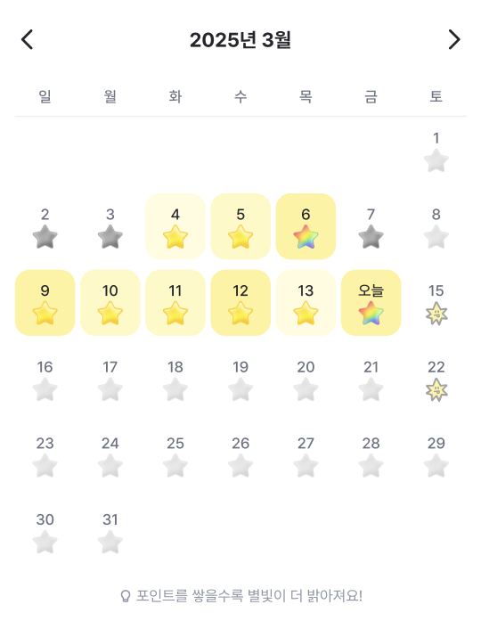

 

## 프로젝트 소개

Web2 => Web3 전환의 역할을 하는 React Native 리워드앱으로,
 
유저는 익숙한 Web2 auth UX를 통해 지갑을 생성하고 다양한 컨텐츠로 획득한 포인트를 Web3 토큰으로 전환하여 손쉽게 Web3 서비스를 경험하게 된다.

 

- 기존 Web3 지갑의 진입장벽을 낮추기 위해 Native AA(Account Abstraction) 기술을 도입하여
  지갑 생성에 대한 어려움을 대신하며 가스비 대납을 지원하는 등 유저 경험을 대폭 개선
- react-native + Expo 기반의 초기 개발환경 및 라우팅 구조 세팅, atomic 컴포넌트 구현을
  담당하였으며, 팀원들의 빠른 앱 개발 전환을 위해 개발 환경 세팅 및 코드 컨벤션에 대한 가이드 문서
  작성
- AA를 지원하는 Openfort 플랫폼의 JS SDK를 활용하기 위해 react-native ⇔ 웹뷰 간의 데이터 통신
  구조 설계 및 AA 지갑 생성 구현
- 유저에게 리워드 지급하기 위한 컨텐츠 및 미니게임 개발 (다른 그림 찾기, 카드 짝맞추기, 객관식/OX
  퀴즈, 기사 읽고 포인트 받기 등)
- 테스트앱 배포 프로세스에 대한 github actions 파이프라인 구축하여 Firebase App Distribution
  자동화 처리

 

## 상세 역할

### <U>초기 개발환경 구축 및 문서화 진행</U>

#### 개요

- Web3 기반 모바일 앱 개발을 위해 React Native + Expo 기반의 앱 초기 구조 세팅을 담당하였으며, 개발팀이 빠르게 공통 구조를 바탕으로 기능 구현에 집중할 수 있도록 환경 구성 및 문서화를 주도함.

#### 주요 역할 및 기여

- Expo 기반 개발 환경 구성
  - Expo + TypeScript + React Native 프로젝트 초기 세팅
  - iOS/Android 디바이스에서 공통 개발 가능한 환경 구축 (expo run, expo start, eas build 등)
  - 환경 별 .env 설정
- 라우팅 및 구조 설계
  - React Navigation 기반의 expo-router Stack/Tab 구조 정의 및 라우터 세팅
  - 라우팅 구조에 맞춘 폴더 구조 구성
- Atomic 컴포넌트 설계 및 공통 UI 구축
  - 공통 UI 요소를 재사용 가능한 Atomic 구조(Button, Typo, Badge, Modal, Icon 등)로 구현
  - 디자이너와 협업하여 variant 기반의 재사용성 높은 UI 컴포넌트화
- 개발 가이드 및 코드 컨벤션 문서화
  - 팀원들의 빠른 온보딩을 위해 Confluence 개발 컨벤션 가이드 작성

#### 성과

- 새로 투입된 팀원들이 빠르게 앱 구조를 이해하고 기능 개발 시작 가능
- 공통 UI 컴포넌트 기반으로 개발 속도 및 UI 일관성 향상
- Web3 + Native 환경에 익숙하지 않은 팀원들도 표준화된 개발 방식으로 쉽게 적응

<!-- ### <U>Native AA(Account Abstraction) 지갑 통합</U>

#### 개요

- 기존 Web3 지갑 사용 시 발생하는 복잡한 지갑 생성 절차, 가스비 부담, UX 단절 문제를 해결하기 위해 Native AA 기술을 도입.
- Openfort의 Embedded Wallet을 활용해 OAuth 기반 지갑 생성과 가스비 대납을 포함한 트랜잭션 실행을 React Native 환경에서 구현.

#### 주요 역할 및 기여

- WebView로 구성된 Openfort Embedded Wallet을 활용하여 사용자가 Google/Apple 로그인만으로 자동으로 AA 지갑 생성이 가능하도록 설계
- ## OAuth 토큰 ↔ React Native ↔ WebView ↔ Openfort JS SDK 간 통신 구조 설계:
   -->

 

### <U>리워드 지급 컨텐츠 개발</U>

#### 개요

- Web3 지갑 사용자의 지속적인 유입과 활동 유도를 위해 포인트 보상형 콘텐츠 및 미니게임 기능을 기획 및 개발하였으며, 앱 내 리텐션 요소로서 기능을 고도화하고 사용자별 리워드 흐름과의 연동까지 설계함.

#### 주요 역할 및 기여

- 다양한 인터랙티브 컨텐츠 개발
  - 미니 게임 (다른 그림 찾기/카드 짝 맞추기)
    - react-native-reanimated의 `useSharedValue`, `useAnimatedStyle`을 활용해 카드 flip 애니메이션 구현
    - Animated 컴포넌트의 layout 트랜지션 활용하여 자연스러운 게임 뷰 전환 효과 적용
    - 일부 낮은 스펙의 AOS 환경에서 `withTiming`이 정상적으로 동작하지 않는 이슈를 발견 => `requestAnimationFrame`으로 JS 스레드에서 동작하도록 수정하여 버그 해결
    - 공유하기 기능 구현: 게임 실패 시 앱 공유 후 재도전 가능하도록 react-native-share 활용하여 공유하기 기능 구현
  - OX/객관식 퀴즈
    - 퀴즈 종류에 따라 시작/퀴즈/정답/오답 뷰 컴포넌트 설계
    - 광고 보고 재시도 기능 구현
  - Read to Earn (기사 읽고 포인트 받기)
    - 10초 동안 news 페이지에 머무를 시 포인트 지급되도록 로직 구현

  <video controls muted width="200" height="433">
    <source src="https://res.cloudinary.com/dskwaqugd/video/upload/v1744448221/pairing.mp4" type="video/mp4" />
  </video>

  <video controls muted width="200" height="433">
    <source src="https://res.cloudinary.com/dskwaqugd/video/upload/v1744448221/find-diff.mp4" type="video/mp4" />
  </video>

   <video controls muted width="200" height="433">
    <source src="https://res.cloudinary.com/dskwaqugd/video/upload/v1744448222/multiple.mp4" type="video/mp4" />
  </video>

   <video controls muted width="200" height="433">
    <source src="https://res.cloudinary.com/dskwaqugd/video/upload/v1744448223/news.mp4" type="video/mp4" />
  </video>

 
 

### <U>유저 사용성 개선을 위한 UX 최적화 및 인터랙션 설계</U>

#### 개요

- 앱 사용성을 높이고, 유저의 행동 유도 및 컨텐츠 몰입도를 향상시키기 위해 UX 측면에서의 개선 아이디어 도출과 기술적 구현을 병행

#### 주요 역할 및 기여

- 홈 화면 로딩 시 Layout Shift 최적화

  - useQuery의 isLoading 상태를 명령형으로 처리하던 초기 컴포넌트 구조가 데이터 로딩 후 레이아웃 트랜지션과 함께 렌더됨으로 인해 홈 화면에서 심각한 레이아웃 쉬프트 발생
  - 이를 해결하고 사용자 경험을 일관되게 유지하기 위해 `useSuspenseQuery`와 `<Suspense>`를 조합하여 선언형 방식으로 컴포넌트 구성
  - 로딩 UI와 렌더되는 컴포넌트의 책임이 분리되어 가독성 및 유지보수 향상
  - 스켈레톤 컴포넌트를 로딩 UI로 활용하여 layout shift 개선 및 시각적 안정성 향상

  

    <video controls muted width="200" height="433">
      <source src="https://res.cloudinary.com/dskwaqugd/video/upload/v1744451785/home-before.mp4" type="video/mp4" />
    </video>
     
Before

  

  

    <video controls muted width="200" height="433">
      <source src="https://res.cloudinary.com/dskwaqugd/video/upload/v1744451786/home-after.mp4" type="video/mp4" />
    </video>
    
After

  

<!-- - TabBar 상단 스크롤 기능 구현

  - 유저가 다시 최상단까지 스크롤하는 불편함을 해소하기 위해 하단 탭바의 해당 탭 아이템 터치 시 최상단으로 스크롤되는 추가 기능 제안 및 구현
  - 현재 라우트에 해당하는 스크롤뷰의 스크롤 포지션 감지하고 최상단으로 scrollTo 처리하도록 `useScrollViewRef` 커스텀 훅 및 global 스토어 활용 -->

- 스크롤 사용성 개선

  - TabBar 상단 스크롤 기능 구현
    - 유저가 다시 최상단까지 스크롤하는 불편함을 해소하기 위해 하단 탭바의 해당 탭 아이템 터치 시 최상단으로 스크롤되는 추가 기능 제안 및 구현
    - 현재 라우트에 해당하는 스크롤뷰의 스크롤 포지션 감지하고 최상단으로 scrollTo 처리하도록 `useScrollViewRef` 커스텀 훅 및 global 스토어 활용
  - 스토어 토큰 정보 sticky 고정 처리
    - 유저가 쿠폰 구매 페이지에서 스크롤을 내리더라도 보유 토큰 정보를 상단에 노출시켜 정보 접근성 향상시킴

- 쿠폰 구매에 필요한 조건 넛지 구현

  - 기존에 쿠폰 구매 가능한 상태가 아니라면 토큰이 부족하다는 버튼 disabled 처리에 그치던 UX가 유저 친화적이지 못하다는 피드백에 따라, 유저가 쿠폰 구매를 위해 필요한 포인트 혹은 토큰 수량이 부족할 경우, 부족한 수량을 노출하고 필요한 활동을 안내하여 적극적인 앱 사용 유도
  - 쿠폰 금액과 보유 토큰/포인트 수량을 비교하여 구매 조건 충족하는지 체크하는 로직 구현
    - 토큰 수량은 부족하지만 토큰 전환할 만큼의 포인트를 보유하고 있는 경우, 필요한 포인트 수량을 입력시킨 상태의 포인트 전환 페이지로 이동시킴
    - 토큰과 포인트 모두 부족할 경우, 친구 초대 이벤트 혹은 미니게임/퀴즈 등의 포인트 지급 컨텐츠로 유도시킴

- '별빛 밝히기' 기능 아이디어 제공
  - 유저 리텐션을 높이기 위한 출석 체크 기반의 '별빛 밝히기' 기능 구현
  - Github 잔디 그래프에서 착안하여, 유저의 컨텐츠 참여도에 따라 별빛의 밝기를 다르게 보여주도록 하는 아이디어 제안하여 기획 단계부터 기능 구현까지 모든 과정에 참여

  
  

 

- 네트워크 연결 예외 처리 및 비연결 상태 UI 제공
  - `@react-native-community/netinfo`를 활용하여 네트워크 연결 상태를 실시간 모니터링
  - 연결이 끊겼을 경우, 화면 전체를 커버하는 “네트워크 연결 안됨” 뷰를 표시하여 사용자 혼란 방지
  - `ErrorBoundary`를 활용하여 네트워크 문제와 API 에러에 대한 예외처리를 함께 적용

 

### <U>리스트 렌더링 성능 최적화</U>

#### 개요

- 기존 쿠폰 리스트 페이지가 Intersection Observer를 활용한 무한 스크롤 형태로 구현되어 있었으나, 스크롤에 따라 리스트가 길어질수록 일부 안드로이드 기기에서 스크롤 렉 현상이 발생
- 해당 문제를 해결하기 위해 React Native 공식 문서의 [FlatList 최적화 가이드](https://reactnative.dev/docs/optimizing-flatlist-configuration)를 바탕으로 리스트 렌더링을 정밀하게 튜닝하고, 스크롤 성능을 체감적으로 향상시킴

#### 주요 역할 및 기여

- Flatlist 렌더링 옵션 조정
  - removeClippedSubviews: 화면 밖 뷰 제거로 메모리 절약 (true)
  - maxToRenderPerBatch: 스크롤 중 한번에 렌더할 항목 수 제한 (8)
  - getItemLayout: 고정 높이 레이아웃 최적화로 스크롤 위치 계산 비용 절감
- 이미지 최적화
  - 각 쿠폰 아이템의 이미지를 기존 `expo-image`에서 `@d11/react-native-fast-image`로 교체하여 이미지 최적화 적용
  - 기존 이미지 컴포넌트는 JS스레드에서 이미지 로드까지 처리함에 반해 `react-native-fast-image`는 네이티브 레이어에서 이미지 요청과 캐싱을 처리하기 떄문에 JS스레드를 이미지 작업에서빠르게 해방시키고 결과적으로 렌더링 및 UI 반응성을 향상시킴
- 불필요한 리렌더링 방지
  - renderItem 함수를 JSX 외부에 위치시키고 useCallback과 memo()를 활용하여 불필요한 리스트 리렌더링 방지
  - keyExtractor 정의하여 diff 성능 개선
